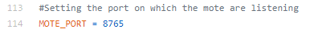

# LINGI2146

## Configuring ipv6 adresses and ports

### On the control server side

Firstly, edit the following code in [control_server.py](control_server/control_server.py) with the port on which the IoT devices will be listening.



Secondly, edit the following code in [control_server.py](control_server/control_server.py) with the correct ipv6 address of each IoT device.


Finally, the ipv6 address of the server and the port that it will use to listen and send messages correspond to the 2 parameters you need to enter when launching the control server.<br/>
``` bash
    python control_server.py [ipv6] [port]
```

### On the IoT device side

If necessary, in the file of each mote, edit the port that the device will use to receive and send messages to the server (UDP_CLIENT_PORT). Also edit the REMOTE_SERVER_PORT such that it corresponds to the port the server is listening on.


In the mote c file, we assume that the server_ip is always define as fd00::242:ac11:3.

If you use a different ip on the server side:

Adapt the code according to your ip inside &interface_ip definition.  
[temperature_sensor.c](mote/temperature_sensor.c)


[humidity_sensor.c](mote/humidity_sensor.c)
    


[motion_detector.c](mote/motion_detector.c) 
    
 
 

[alarm.c](mote/alarm.c)
    


As you can see on the last 2 previous pictures, the alarm and the motion detector ip_addresses has been fixed fe80::c30c:0:0:3 and  fe80::c30c:0:0:4 respectivly. If needed, change those two to the one corresponding to your simulation.
